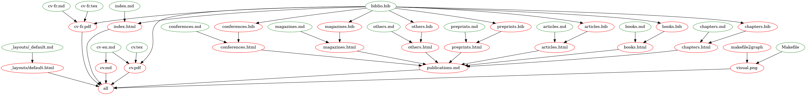

# jilljenn.github.io

Collection of scripts to generate my homepage and my CV.

You may be interested in this if you care about:

- multilingual bibliographies (thanks `autolang=other`)
- sectioned bibliographies in pandoc (thanks [`bib2bib`](https://www.lri.fr/~filliatr/bibtex2html/doc/manual.html#sec13))
- writing Chinese in LuaLaTeX (thanks `luatexja-fontspec`)

